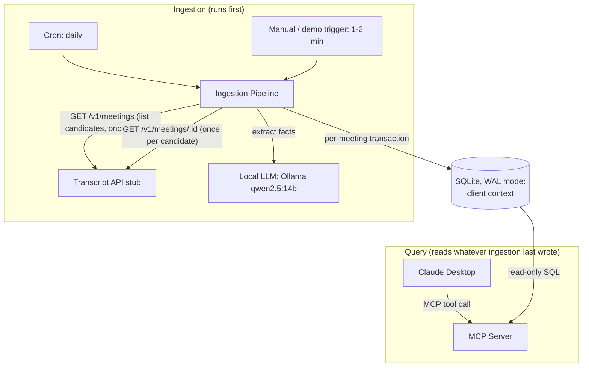

# Client Context Ingestion System — Design

## 1. Overview

Turn Corridor meeting transcripts into a per-client "client context": a versioned,
auditable set of structured facts, kept fresh by a pollable ingestion pipeline, and
exposed read-only to LLM agents via an MCP server.

Primary evaluation criterion is correctness: right facts, right client, intact
audit trail, no torn reads, no data loss on failure. Design choices below are made
in that order of priority — auditability and consistency before convenience.

## 2. Goals & Non-Goals

**In scope**

- Poll the stub transcript API, extract configured facts per client via LLM, persist
with full version history and provenance.
- MCP server exposing current facts + enough metadata to prove freshness.
- Fault-tolerant pipeline: partial failures don't lose data or corrupt state.
- One agent integration (Claude Desktop) + freshness demo.

**Out of scope / explicitly simplified**

- Auto-discovery of new fact types from transcript content. The fact schema is a
manually maintained config; "configurable" is read as "no code changes needed to
add a fact," not "the pipeline invents new fact types." See §7.
- Robust client entity resolution (fuzzy matching, merge/split of misidentified
clients). We do normalized-name matching only — see Open Questions.
- Multi-tenant auth/access control on the MCP server — single-operator use assumed.
- Historical point-in-time queries (`as_of`) on the MCP tool — schema supports it
(full version history is stored), but it's not exposed as a first tool. Noted as
a cheap follow-up.


## 3. Architecture




Pipeline and MCP server are separate processes that only share the database —
the MCP server never talks to the pipeline directly and never caches state in
memory, per the spec's requirement that it read the DB as source of truth.

## 4. Components

### 4.1 Ingestion Pipeline

Runs as a CLI entrypoint (`npm run ingest`) invokable by:

- an OS/cron scheduler (daily, production mode), and
- an on-demand manual invocation (testing, and the freshness demo — see §4.5).

Same code path every time — only what triggers it differs.

**Per-run algorithm:**

1. Check for another run in flight: look for an `ingestion_runs` row with
  `status='running'`; if found, log and exit cleanly rather than starting a
   second one. Any actual concurrent write attempt is also caught at the SQLite
   level — a second writer blocks (up to `busy_timeout`) or fails with
   `SQLITE_BUSY`, since SQLite serializes writers natively — but the run-status
   check avoids even getting that far, and gives a cleaner log line than a
   retried busy error.
2. Insert an `ingestion_runs` row (`status='running'`).
3. Build the candidate meeting set:
  - `GET /v1/meetings?updated_after=<stored watermark>` for new/changed meetings, **union**
  - any meeting IDs sitting in `meetings_processed` with `status='failed'` from
  prior runs (explicit retry queue, independent of the watermark).
   Fetch every candidate's full record, then **sort by** `meeting.created_at`
   **ascending** before processing. `api.md` explicitly says the list endpoint's
   order is unordered ("fixture order") — since fact writes are "supersede
   current, write new," processing order *is* what determines the stored
   "current" value. Without this sort, an earlier real-world statement fetched
   later in a run could overwrite a genuinely later correction (caught by
   hand while testing: two same-day Acme meetings 30 minutes apart landed on
   the wrong final headcount until this was added). Sort key is `created_at`
   (when the meeting happened), not `updated_at` (which drives the watermark
   above and answers a different question — "did this record change").
4. For each candidate meeting, in chronological order (the fetch already happened
   in step 3, as part of building the sorted candidate list):
  a. Hash the full fetched record (not just the transcript text — id, timestamps,
      attendees, and transcript together). If a `meetings_processed` row already
      exists for this ID with `status='success'` and the same hash, skip
      (idempotent no-op — safe against redundant polls).
   b. Write the raw payload to `meetings` (insert; no-op on a `meeting_id`
      conflict, first write wins) — this commits immediately, on its own,
      independent of everything below. It's deliberately *not* wrapped with
      the extraction/write step, so a failed extraction still leaves durable,
      auditable proof of what the API returned. No-op-on-conflict (rather than
      overwrite) relies on the assumption that a `meeting_id`'s content never
      changes upstream once created (§8 item 5) — a repeat land of a known
      `meeting_id` is expected to be identical content anyway. If that
      assumption doesn't hold, this keeps the *first-seen* payload rather than
      the latest, which stays consistent with whatever `fact_versions` rows
      have already been extracted from it, at the cost of the table going
      stale relative to a genuine later correction. This isn't a silent
      no-op, though: the existing payload is compared against the newly
      fetched one before discarding it, and a mismatch is logged loudly
      (`console.error`, `[ingest] ANOMALY: ...`) as evidence the §8 item 5
      assumption has actually been violated. When that happens, extraction
      (steps c–f) is skipped entirely for that meeting this run — deliberately
      *not* routed through the normal per-meeting failure path (no
      `meetings_processed` row, no retry-queue entry, no effect on
      `succeeded`/`failed`/run status). Since this scenario is built on the
      assumption that it should never occur, treating it like an ordinary
      extraction failure — with its own tracking and retry bookkeeping —
      would overbuild for something assumed unreachable; the log line is the
      only signal, by design. One consequence: because no `meetings_processed`
      row gets written, this meeting is simply reconsidered as a fresh
      candidate on any future run where it reappears in the API's list
      response, so a genuine, persistent contract violation will keep
      re-triggering (and re-logging) this same check indefinitely, with no
      dedicated retry mechanism needed to make that happen.
   c. Call the extraction LLM with the transcript + the fact list (`config/facts.mts`
      — see §7) using forced structured output.
   d. Validate the LLM's output against each fact's declared type. Reject
      malformed values rather than writing them.
   e. Resolve the client (normalized-name lookup, create if new).
   f. **In one DB transaction:** for each extracted fact, supersede the current
      version row and insert the new one (see §5 for the exact statements), then
      upsert `meetings_processed` (`status='success'`, hash, run id). Commit. On
      any failure in c–f, roll back this transaction — no partial fact update or
      success marker is left — and instead write `meetings_processed`
      (`status='failed'`, the error) in a **separate** small transaction, so one
      bad transcript doesn't block or corrupt the others. Note the raw payload
      from step b is *not* rolled back with it — see above.
5. Mark `ingestion_runs` `succeeded` / `partial` (some meetings failed) /
  `failed` (couldn't reach the API at all). Advance the watermark to the max
   `updated_at` seen this run — safe to do even with some failures, because
   failed meetings stay independently retryable via the retry queue in step 3,
   not via the watermark.

This gives at-least-once, idempotent processing per meeting, isolates failures to
the meeting that caused them, and survives a mid-run crash (restart just re-derives
the candidate set from `meetings_processed` state).

### 4.2 Fact Extraction (LLM)

- **Local model via Ollama** (`qwen2.5:14b`, self-hosted, no API key) rather than
a hosted API — chosen so extraction doesn't depend on Anthropic API billing
during development. `src/pipeline/extract.mts` calls Ollama's `/api/chat`
with `format: <json-schema>`, which uses grammar-constrained decoding to
*guarantee* the response parses as valid JSON matching the schema — a
stronger structural guarantee than relying on a model's tool-calling
training, which matters more for a 14B open model than it would for Claude.
This guarantees shape, not correctness: whether the *values* are right is
still checked by the zod validation layer in §4.1.d, unchanged from the
original design.
- Prompt is built from the transcript plus the fact list in `config/facts.mts`
(key, description, data type, extraction hint) — see §7 for why this is a static
module rather than a live read of the `fact_definitions` table.
- Extraction also returns a short supporting quote per fact, stored alongside the
value for provenance ("why did we conclude this") beyond just "which meeting."
- Known tradeoff: a 14B open model is less reliable than Claude on genuine
disambiguation (e.g. the Acme fixture where a headcount figure is corrected
mid-transcript). Worth spot-checking those specific cases against the
fixture data rather than assuming parity.


### 4.3 Client Context Store (SQLite, WAL mode)

Implemented with Node's built-in `node:sqlite` (`DatabaseSync`) rather than a
native addon like `better-sqlite3` — the latter failed to build from source
against this project's Node version (no prebuilt binary yet, and the source
build hit V8 API incompatibilities), and `node:sqlite` needs no compilation
step at all, which is one less thing for a reviewer to fail to build.

`PRAGMA journal_mode=WAL` and `PRAGMA busy_timeout=5000` set on connection open —
WAL gives readers a non-blocking consistent snapshot even during a write (§5);
`busy_timeout` makes a rare overlapping writer wait briefly and retry instead of
failing immediately. IDs are app-generated UUID strings (`crypto.randomUUID()`)
rather than a DB-native uuid type, and timestamps are stored as ISO-8601 text —
both are SQLite's normal idioms given its dynamic typing.

```sql
-- read mirror of config/facts.mts, reseeded on every startup (§7) — MCP server
-- reads this table; the extraction pipeline reads the source module directly
CREATE TABLE fact_definitions (
  fact_key      TEXT PRIMARY KEY,
  display_name  TEXT NOT NULL,
  description   TEXT NOT NULL,      -- fed into the extraction prompt
  data_type     TEXT NOT NULL,      -- 'number' | 'string' | 'date' | 'money' | 'plan_list' | ...
  extraction_hint TEXT,
  active        INTEGER NOT NULL DEFAULT 1,   -- 0/1 boolean
  created_at    TEXT NOT NULL DEFAULT (strftime('%Y-%m-%dT%H:%M:%fZ','now'))
);

CREATE TABLE clients (
  client_id      TEXT PRIMARY KEY,   -- app-generated UUID
  canonical_name TEXT NOT NULL,
  normalized_name TEXT UNIQUE NOT NULL,  -- lowercased/trimmed, used for matching
  created_at     TEXT NOT NULL DEFAULT (strftime('%Y-%m-%dT%H:%M:%fZ','now'))
);

-- landing zone: first-seen payload per meeting_id, written independently of
-- whether extraction later succeeds (§4.1.4b) — insert-only, no-op on a
-- meeting_id conflict, on the assumption that a meeting_id's content is
-- immutable upstream (§8 item 5)
CREATE TABLE meetings (
  meeting_id  TEXT PRIMARY KEY,
  raw_payload TEXT NOT NULL,          -- JSON, via SQLite's json1 functions when queried
  fetched_at  TEXT NOT NULL DEFAULT (strftime('%Y-%m-%dT%H:%M:%fZ','now'))
);

-- idempotency + retry checkpoint. Deliberately no FK to meetings: this table
-- must also record a failed *fetch* (meeting_id known, but no payload ever
-- landed), so it can't require a landing row to already exist. Still joins
-- to meetings informally on meeting_id when a landing row does exist.
CREATE TABLE meetings_processed (
  meeting_id     TEXT PRIMARY KEY,
  content_hash   TEXT NOT NULL,
  status         TEXT NOT NULL,     -- 'success' | 'failed'
  error_message  TEXT,
  ingestion_run_id TEXT NOT NULL REFERENCES ingestion_runs(run_id),
  processed_at   TEXT NOT NULL DEFAULT (strftime('%Y-%m-%dT%H:%M:%fZ','now'))
);

CREATE TABLE ingestion_runs (
  run_id       TEXT PRIMARY KEY,    -- app-generated UUID
  trigger_type TEXT NOT NULL,       -- 'cron' | 'manual' | 'demo'
  status       TEXT NOT NULL,       -- 'running' | 'succeeded' | 'partial' | 'failed'
  started_at   TEXT NOT NULL DEFAULT (strftime('%Y-%m-%dT%H:%M:%fZ','now')),
  completed_at TEXT,
  watermark    TEXT,                -- max updated_at successfully seen this run
  error_message TEXT                -- set when status='failed' at the run level (§4.1 step 3)
);

-- append-only, SCD-2 style: the audit trail IS the storage model
CREATE TABLE fact_versions (
  version_id       INTEGER PRIMARY KEY AUTOINCREMENT,
  client_id        TEXT NOT NULL REFERENCES clients(client_id),
  fact_key         TEXT NOT NULL REFERENCES fact_definitions(fact_key),
  value            TEXT NOT NULL,     -- JSON-encoded
  source_meeting_id TEXT NOT NULL REFERENCES meetings(meeting_id),
  source_excerpt   TEXT,
  ingestion_run_id TEXT NOT NULL REFERENCES ingestion_runs(run_id),
  valid_from       TEXT NOT NULL DEFAULT (strftime('%Y-%m-%dT%H:%M:%fZ','now')),
  valid_to         TEXT                -- NULL = currently active
);

-- exactly one active version per (client, fact) at a time
CREATE UNIQUE INDEX one_current_fact
  ON fact_versions (client_id, fact_key)
  WHERE valid_to IS NULL;
```

History is not a separate table you have to keep in sync — it falls out of never
deleting a `fact_versions` row. "Current" is just `WHERE valid_to IS NULL`. The
partial unique index (SQLite has supported these since 3.8) is what makes the
storage model, not the specific engine — this schema would port back to Postgres
largely by swapping column types if the deployment shape ever changed (§8).

### 4.4 MCP Server

Two read-only tools: `get_client_context` (current state) and `get_fact_history`
(full audit history for one fact — see below).

**Presentation contract (prompting, not schema):** the tool description tells the
calling agent to show just the current facts/values by default, and only surface
provenance/`as_of`/`version`/`previous_value` when the user's question specifically
calls for it (e.g. "when was this updated," "has this changed"). The full payload —
all fields, every call — is always returned regardless; this is guidance about what
the agent chooses to *display*, not a restriction on what the server sends. Same as
the `as_of`-vs-version wording earlier in this section: a soft prompting steer, not
something the server can enforce or guarantee.

**Input**

```json
{ "client": "Acme Benefits" }
```

(matched against `clients.normalized_name`; exact `client_id` also accepted.)

**Output**

```json
{
  "client_id": "…",
  "client_name": "Acme Benefits",
  "context_fingerprint": "…",       // hash/max(valid_from) across current facts —
                                     // changes iff anything about this client changed
  "facts": [
    {
      "key": "employee_count",
      "value": 26,
      "as_of": "2026-05-20T19:00:00Z",
      "version": 3,
      "previous_value": 27,
      "source": {
        "meeting_id": "mtg_acme2026052001",
        "excerpt": "The corrected employee count is 26."
      }
    },
    {
      "key": "benefit_cycle_start",
      "value": "2026-07-01",
      "as_of": "2026-05-18T13:00:00Z",
      "version": 1,
      "previous_value": null,
      "source": {
        "meeting_id": "mtg_acme2026051801",
        "excerpt": "our benefit cycle starts July 1, 2026"
      }
    },
    {
      "key": "preferred_plan_type",
      "value": "PPO",
      "as_of": "2026-05-18T13:00:00Z",
      "version": 1,
      "previous_value": null,
      "source": {
        "meeting_id": "mtg_acme2026051801",
        "excerpt": "We prefer a PPO because employees use providers across two states."
      }
    },
    {
      "key": "employer_budget_monthly",
      "value": 725,
      "as_of": "2026-05-21T10:00:00Z",
      "version": 2,
      "previous_value": 700,
      "source": {
        "meeting_id": "mtg_acme2026052101",
        "excerpt": "the board approved a higher employer budget of $725 per employee per month"
      }
    }
  ]
}
```

(One entry per active `fact_definitions` row for that client — four shown here
since Acme's transcripts have all four core facts; a client with sparser
transcripts would simply have fewer entries, not nulls. Flat, not nested —
nesting fields under a `provenance` object was tried and dropped: an LLM
consumer reads the whole payload regardless of nesting depth, so it added no
real steering while making the raw JSON harder to read for a human debugging
it. `as_of` — the meeting date, when the fact was actually confirmed — is the
*only* date-like field anywhere in this payload. Two earlier iterations each
exposed a second, system-processing timestamp under a different name
(`ingested_at` per-fact, then `last_ingested_at` at the envelope level after
the first was removed) and in live testing the calling agent surfaced *both*
as "last updated" despite explicit instructions not to, every time. Rather
than continue trying to out-instruct that, both were removed outright — the
one remaining date field can't be confused with anything else. A caller that
still wants a pure system-freshness signal (not tied to any date) has
`context_fingerprint`, an opaque hash that changes iff anything about the
client changed — it can't be misread as a timestamp because it isn't one.)

**Errors** (returned as MCP tool errors the agent can read and reason about, not
protocol-level exceptions):

- unknown client → `not_found` with the searched value echoed back.
- missing/empty `client` param → `invalid_request`.

**Consistency guarantee:** the handler issues a single SQL statement joining
`fact_versions WHERE valid_to IS NULL` for the client with `fact_definitions` for
display metadata — one statement, one WAL-mode read snapshot, so a caller can
never see fact A's new value alongside fact B's stale one mid-update. No
in-memory caching layer; every call hits the database file directly.

**Second tool:** `get_fact_history`**.** `get_client_context` only returns a fact's
current value plus one step back (`previous_value`) — not enough to answer an
audit question like "how has the employee count changed over time," which the
spec's auditability requirement explicitly calls for ("what were the **prior
values**," plural). This tool returns the full chronological chain for one
specific fact, using data that already exists — `fact_versions` is append-only,
so nothing is ever deleted; this tool just queries all rows instead of only the
current one.

**Input**

```json
{ "client": "Acme Benefits", "fact_key": "employee_count" }
```

**Output**

```json
{
  "client_id": "…",
  "client_name": "Acme Benefits",
  "fact_key": "employee_count",
  "history": [
    { "value": 25, "as_of": "2026-05-18T13:00:00Z", "is_current": false,
      "source": { "meeting_id": "mtg_acme2026051801", "excerpt": "we have 25 benefits-eligible employees today" } },
    { "value": 27, "as_of": "2026-05-20T18:30:00Z", "is_current": false,
      "source": { "meeting_id": "mtg_acme2026052002", "excerpt": "Please update the expected headcount to 27." } },
    { "value": 26, "as_of": "2026-05-20T19:00:00Z", "is_current": false,
      "source": { "meeting_id": "mtg_acme2026052001", "excerpt": "The corrected employee count is 26." } },
    { "value": 29, "as_of": "2026-05-23T14:00:00Z", "is_current": true,
      "source": { "meeting_id": "mtg_acme2026052301", "excerpt": "We've grown to 29 benefits-eligible employees this month." } }
  ]
}
```

Ordered chronologically by `version_id` (our processing order, which already
matches real-world chronology — see §4.1's sort-by-`created_at` fix). Only the
last entry has `is_current: true`; there's no `version` field here since the
entry's position in the array already conveys that, and no `previous_value`
per-entry since each entry's predecessor is just the one before it in the list.

**Errors:** `not_found` for an unknown client (same as `get_client_context`);
`invalid_request` for a `fact_key` not present in `fact_definitions`, listing
the valid keys — validated against the same config-driven list `extract.mts`
uses (§7), so a new configured fact is queryable here immediately, no code
change needed.

### 4.5 Agent Integration & Freshness Demo

Claude Desktop, MCP server registered locally via `claude_desktop_config.json`.
Demo trigger: the on-demand `npm run ingest` invocation from §4.1, run manually
during the recording — no interval poller needed, since the spec's actual
requirement is "runnable on demand for testing and the freshness demo," and the
1–2 min interval option is offered as one way to satisfy that, not a mandate.

1. Ask Claude about client X → answer cites current fact + `updated_at`.
2. Drop in an updated/new meeting (new `mtg_*` entry, bumped `updated_at`) into
  the fixture file, then manually run `npm run ingest`.
3. Ask again in the same thread → new MCP call returns a changed
  `context_fingerprint`/`updated_at`/`previous_value`, proving it's a live read,
   not a repeated/cached answer.


## 5. Consistency & Concurrency Strategy

- **Writes**: each fact update is "supersede old row, insert new row" inside one
transaction, enforced current-row uniqueness via the partial unique index in
§4.3. Concurrent ingestion runs are prevented in the common case by the
run-status check in §4.1, and even if that were somehow bypassed, SQLite only
ever allows one writer at a time — a second writer blocks (`busy_timeout`) or
fails cleanly with `SQLITE_BUSY` rather than racing.
- **Reads**: WAL mode gives every read transaction a consistent snapshot as of
when it started, and readers are never blocked by (or block) a concurrent
writer. A single-statement MCP read therefore always sees either the old
values or the new ones, never a mix — this is what satisfies "a reader never
observes a partially-updated view."


## 6. Fault Tolerance Strategy


| Failure                                           | Handling                                                                                                                                                                        |
| ------------------------------------------------- | ------------------------------------------------------------------------------------------------------------------------------------------------------------------------------- |
| Transcript API unreachable                        | Run marked `failed` before any meeting work; nothing written; next scheduled run retries from the same watermark.                                                               |
| API returns a meeting that fails to fetch mid-run | That meeting's transaction never starts; other meetings in the run are unaffected.                                                                                              |
| LLM call fails/times out for one meeting          | That meeting's transaction rolls back, `meetings_processed.status='failed'`, retried automatically next run via the retry queue.                                                |
| LLM returns malformed/off-schema output           | Rejected by validation before any DB write; treated the same as an LLM failure.                                                                                                 |
| DB write fails mid-transaction                    | Full rollback (atomicity) — no partial fact update ever becomes visible.                                                                                                        |
| Process crashes mid-run                           | Per-meeting transaction boundaries mean at most the in-flight meeting is lost, not committed; `meetings_processed` state lets a fresh process resume exactly where it left off. |
| Two triggers fire at once (cron + demo)           | Run-status check exits the second run immediately; if both somehow start together, SQLite's single-writer semantics serialize them rather than racing.                          |
| Meeting re-fetched with content differing from what's landed | Logged as `ANOMALY`, extraction skipped for that meeting this run; not tracked in `meetings_processed` or retried — treated as should-never-happen under §8 item 5.             |


## 7. Configurable Fact Schema

The fact list's source of truth is the static array `FACT_DEFINITIONS` in
`src/config/facts.mts`, not the `fact_definitions` table directly. On every
startup, `getDb()` seeds/upserts that table from the array (`client.mts`,
`seedFactDefinitions`) — so the table is a **read mirror** of the code config,
used by the MCP server for display metadata and `fact_key` validation (§4.4),
not the other way around. Adding a new fact — e.g. "renewal date" — means
adding one entry to `FACT_DEFINITIONS`; the extraction prompt (§4.2) and the
MCP output (§4.4) are both built dynamically from that list, so it's a single,
contained code change (no pipeline logic touched) rather than the zero-code-change
DB-row-insert originally envisioned here. Inserting a row into `fact_definitions`
directly, without also adding it to the array, would make the MCP server aware
of the fact's shape but the pipeline would never extract it — and the next
process restart would leave that row as-is (the seed only upserts rows present
in the array; it doesn't delete or deactivate ones that aren't).

This is read as a **manually curated whitelist**, not an auto-expanding one — the
pipeline does not invent new fact types from transcript content it wasn't asked
to look for. Rationale: undefined, LLM-invented fact types would undermine the
audit/correctness guarantees (no fixed type, no stable key to version against).

## 8. Open Questions / Assumptions

These are flagged rather than silently decided:

1. **Client entity resolution** — using normalized-name matching only (no fuzzy
  matching, no manual merge tooling). Fine for the fixture data's 3 distinct
   clients; a real system would need a harder identity-resolution story
   (aliases, misspellings, an LLM double-check when the match is ambiguous).
2. **Fact schema whitelist vs. discovery** — assuming manual config per §7;
  confirmed as reasonable in prior discussion but worth a one-line confirmation
   with the interviewer if asked.
3. **SQLite vs. Postgres** — decided on SQLite (WAL mode): the concurrency
  profile here is one operator, infrequent on-demand triggers plus a daily
   cron, all on a single machine — SQLite's native writer serialization and
   WAL-mode read snapshots satisfy the same consistency requirements as
   Postgres would, with no external service to install/run. Postgres would
   only earn its keep if the pipeline and MCP server became separately
   deployed services on different machines (SQLite has no network protocol,
   and its file-locking is explicitly unsafe over network filesystems) —
   not the case here.
4. `as_of` **historical queries** — schema supports them for free (nothing is
  ever deleted from `fact_versions`), but not exposing it as a tool input
   initially to keep the MCP contract minimal. Easy to add later.
5. **Meeting content immutability per `meeting_id`** — the `meetings` landing
  table (§4.3) is insert-only, no-op on a `meeting_id` conflict (first write
   wins, never overwritten), which assumes a given `meeting_id`'s content never
   changes upstream once created; `updated_at` is assumed to reflect transcript
   finalization/metadata timing, not a content edit. Nothing in `api.md`
   actually guarantees this — it documents `created_at` and `updated_at` as
   distinct fields and offers `updated_after` as its own filter, which is
   naturally read the other way (why distinguish them if content can't change?).
   The fixture data doesn't exercise a counterexample either: all 14 meetings
   have unique ids, and `updated_at` trails `created_at` by a consistent
   ~40–70 minutes across the board, consistent with "finalized shortly after
   the meeting ended" rather than "edited later." No-op-on-conflict was chosen
   over overwrite specifically so a wrong assumption fails safe: if a
   `meeting_id`'s content ever does change upstream, the table just goes stale
   (keeps the original payload) rather than silently destroying the payload
   that an already-committed `fact_versions` row was extracted from. It also
   isn't silent about it — `storeMeetingLanding` (§4.1 step 4b) diffs the
   incoming payload against what's already landed and logs an `ANOMALY` line
   if they differ, so a violation of this assumption is at least visible in
   the logs rather than only discoverable by noticing stale data later.
   Extraction is skipped for that meeting on the same run — not just the
   landing write — since processing facts from content that contradicts a
   stated invariant seemed worse than doing nothing. This deliberately
   bypasses `meetings_processed`/retry-queue tracking rather than introducing
   a new status for it: under the stated assumption this is expected to never
   happen, so building persistent tracking and recovery for it would be
   solving a problem the design assumes away. The console log is a tripwire
   against that assumption being wrong, not a first step toward automated
   handling. Staleness is still a real cost, though — if this assumption doesn't hold in a real
   deployment, the landing table would need to become properly append-only
   (keyed on `(meeting_id, content_hash)` or a surrogate key, with
   `fact_versions.source_meeting_id` pointing at the specific snapshot rather
   than the bare `meeting_id`) to actually capture a later correction instead
   of just declining to lose the earlier one. Worth confirming with the API owner rather
   than continuing to assume it.


## 9. Tech Stack Summary


| Layer          | Choice                                                         | Why                                                                                                                                                                                                                                                                                             |
| -------------- | -------------------------------------------------------------- | ----------------------------------------------------------------------------------------------------------------------------------------------------------------------------------------------------------------------------------------------------------------------------------------------- |
| Language       | TypeScript / Node                                              | Matches the stub server; one runtime for pipeline + MCP server; mature MCP SDK.                                                                                                                                                                                                                 |
| Database       | SQLite (WAL mode), via Node's built-in `node:sqlite`           | Transactional + consistent-read guarantees from §5/§6 without an external service or a native-module build step (see §4.3 note on `better-sqlite3`'s native build failing on this Node version); single-machine deployment makes Postgres's network/client-server model unnecessary (see §8.3). |
| Extraction LLM | Local Ollama (`qwen2.5:14b`), JSON-schema structured output    | No API key/billing dependency; grammar-constrained decoding compensates for weaker tool-calling training than Claude has (§4.2). Tradeoff: less reliable on genuine disambiguation than Claude.                                                                                                 |
| MCP server     | `@modelcontextprotocol/sdk` (TypeScript), stdio transport      | Local registration in Claude Desktop, no network exposure needed.                                                                                                                                                                                                                               |
| Agent          | Claude Desktop (Pro plan)                                      | MCP support confirmed available; no API key needed for this leg.                                                                                                                                                                                                                                |
| Scheduling     | OS/cron entry (prod) + on-demand CLI invocation (testing/demo) | Same pipeline entrypoint, different trigger cadence.                                                                                                                                                                                                                                            |


